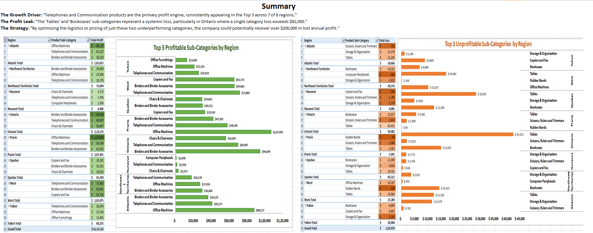

Retail Sales Analysis Project
This repository contains a comprehensive analysis of the Superstore Sales dataset, focusing on identifying sales trends, regional performance, and product profitability.

Project Overview

The goal of this project was to analyze retail data to uncover actionable insights for business growth. By examining transaction history, I identified which regions and product categories were the most and least profitable.

Data Source
Dataset: Superstore Sales Data.

File Format: .xlsx.

Key Analytics & Features
Data Cleaning: Organized raw retail data for accurate reporting.

Pivot Tables: Created summaries to compare sales performance across different Indian regions.

Data Visualization: Developed an Excel dashboard to track monthly sales growth and profit margins.

Tools Used
Microsoft Excel: Data manipulation, Pivot Tables, and Visualization.

Git & GitHub: Version control and portfolio hosting.

Key Insights & Business Impact:

The analysis revealed critical drivers of both profitability and loss across 8 major regions.

1. The Growth Driver: Telephones and Communication
Performance: Telephones and Communication products are the primary profit engine for the business.

Consistency: This category consistently appears in the Top 3 most profitable sub-categories across 7 out of 8 regions.

2. The Profit Leak: Tables and Bookcases
Systemic Loss: The "Tables" and "Bookcases" sub-categories represent a consistent financial drain.

Regional High: The issue is most severe in Ontario, where a single category loss exceeds $42,000.
3. Proposed Strategy
Optimization: By optimizing the logistics or pricing strategies for these two underperforming categories (Tables and Bookcases), the company could potentially recover over $200,000 in lost annual profit.